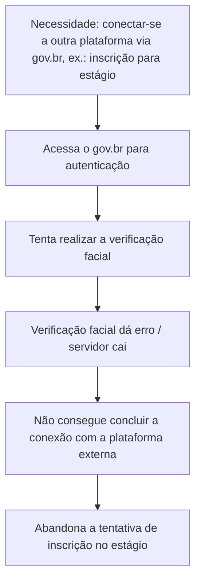
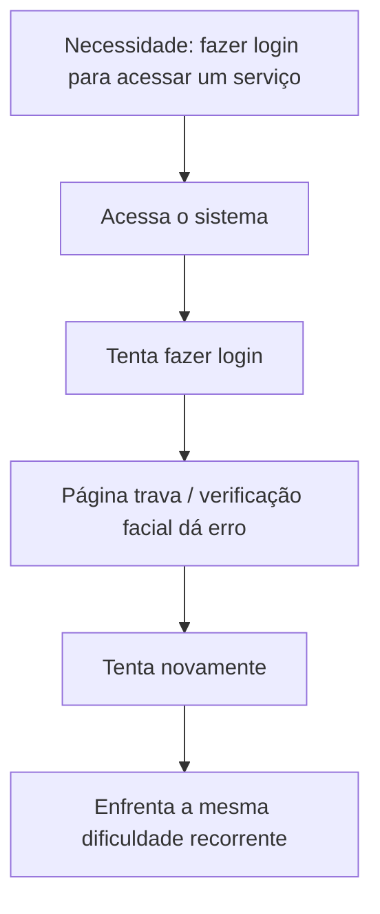
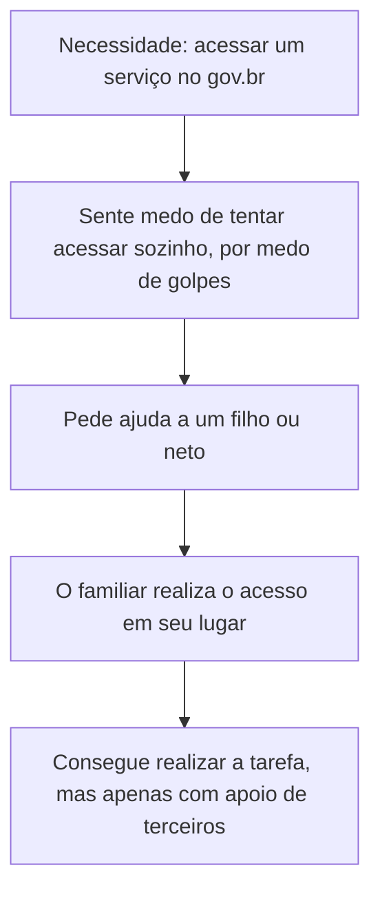

# ➤ Projeto_UX_UI_1-Atividade.md
Projeto de UX UI ( Design Thinking )

# Atividade de UX/UI — gov.br

## Sumário

- [Etapa 1 — Pesquisa](#etapa-1--pesquisa)
- [Etapa 2 — Definição do problema](#etapa-2--definição-do-problema)
- [Etapa 3 — Personas](#etapa-3--personas)
- [Etapa 4 — Jornadas do usuário](#etapa-4--jornadas-do-usuário)

---

## Etapa 1 — Pesquisa

### Usuários identificados e suas tarefas

| Usuário | Perfil | Tarefa no site | Dificuldade relatada |
|---|---|---|---|
| Pedro, 18 anos | Universitário, solteiro | Usar o gov.br como autenticação para se conectar a outras plataformas (ex.: inscrição em estágio) | Erros na verificação facial e queda do servidor no momento da tentativa, impedindo a conclusão da inscrição |
| Marinete, 46 anos | Autônoma, casada | Fazer login no sistema para acessar serviços | Login difícil, páginas que travam constantemente e verificação facial que sempre dá erro |
| José de Assis, 78 anos | Aposentado, divorciado | Acessar serviços do gov.br | Dificuldade de acesso e medo de cair em golpes; por isso pede ajuda de filhos ou netos |

### O que causa frustração

- Falhas técnicas recorrentes (login, verificação facial, instabilidade do servidor).
- No caso do usuário idoso, insegurança e desconfiança em relação à própria capacidade de usar o site sem cair em fraudes.

### Como resolvem atualmente

- [x] **José** — não usa o site sozinho; delega a tarefa a familiares.
- [x] **Marinete** — insiste no processo de login, mesmo com travamentos e erros na verificação facial.
- [x] **Pedro** — depende do site funcionar no momento certo para concluir processos externos (como a inscrição em estágio); quando o servidor cai, a tarefa não é concluída.

---

## Etapa 2 — Definição do problema

> **Problema:** Usuários de diferentes faixas etárias enfrentam barreiras distintas ao usar o gov.br: usuários mais jovens e adultos sofrem com falhas técnicas recorrentes (erros na verificação facial, travamentos e instabilidade do servidor) que impedem a conclusão de tarefas importantes, enquanto usuários idosos evitam o uso direto do sistema por medo de golpes, dependendo de terceiros para realizar até tarefas simples.

Esse problema é sustentado pelas evidências da pesquisa: os três perfis relatam pontos de falha diferentes, mas todos resultam na mesma consequência — **a tarefa não é concluída pelo próprio usuário sem obstáculos ou ajuda externa.**

---

## Etapa 3 — Personas

<table>
<tr>
<th>Persona 1 — Pedro</th>
<th>Persona 2 — Marinete</th>
<th>Persona 3 — José de Assis</th>
</tr>
<tr>
<td valign="top">

**Idade:** 18 anos
**Estado civil:** solteiro
**Perfil:** universitário

**Objetivo:**
Usar o gov.br como meio de autenticação para acessar outras plataformas necessárias à vida acadêmica/profissional

**Necessidade:**
Que a verificação facial funcione corretamente e que o servidor esteja disponível no momento em que precisa

**Dificuldade:**
Verificação facial com erro e queda do servidor justamente ao tentar se inscrever para um estágio

**Comportamento:**
Só acessa o gov.br pontualmente, como intermediário para outro serviço — não é um uso recorrente

</td>
<td valign="top">

**Idade:** 46 anos
**Estado civil:** casada
**Perfil:** autônoma

**Objetivo:**
Fazer login no sistema para acessar os serviços de que precisa

**Necessidade:**
Um processo de login estável, sem travamentos e sem falhas na verificação facial

**Dificuldade:**
Páginas que travam constantemente e verificação facial que sempre dá erro

**Comportamento:**
Insiste tentando fazer login repetidamente, mesmo enfrentando a mesma falha

</td>
<td valign="top">

**Idade:** 78 anos
**Estado civil:** divorciado
**Perfil:** aposentado

**Objetivo:**
Conseguir acessar os serviços do gov.br

**Necessidade:**
Sentir segurança para usar o site sem medo de ser vítima de golpe

**Dificuldade:**
Dificuldade de acesso somada ao medo de cair em fraudes

**Comportamento:**
Não tenta usar o site sozinho; pede ajuda a filhos ou netos para realizar o acesso

</td>
</tr>
</table>

---

## Etapa 4 — Jornadas do usuário

### Jornada de Pedro

### Jornada de Marinete

### Jornada de José de Assis

### Principais pontos de dificuldade identificados nas três jornadas

1. Falha na verificação facial (Pedro e Marinete).
2. Instabilidade/queda do servidor no momento crítico da tarefa (Pedro).
3. Travamento recorrente das páginas (Marinete).
4. Barreira de confiança e medo de golpes, que impede o uso autônomo (José).

   # Etapa 4 — Ideação gov.br

## 1. Retomem o problema

| Questão | Resposta do grupo |
|---|---|
| Qual problema queremos resolver? | Falhas técnicas recorrentes no login/verificação facial e instabilidade do servidor do gov.br, além do medo de golpes que afasta usuários idosos do uso autônomo do site. |
| Quem é o usuário? | Marinete, 46 anos, autônoma (persona principal); Pedro, 18 anos, universitário; José de Assis, 78 anos, aposentado. |
| Qual é a principal necessidade desse usuário? | Conseguir fazer login e concluir tarefas no gov.br de forma estável, segura e sem depender de terceiros. |
| Qual é a principal dor identificada na jornada? | Erro constante na verificação facial e travamento das páginas durante o login (Marinete); queda do servidor no momento crítico (Pedro); medo de golpes que impede o acesso sozinho (José). |
| Em qual momento essa dor acontece? | No momento da autenticação/login e da verificação facial. |
| O que deveria melhorar na experiência? | O processo de login deveria ter alternativas quando a verificação facial falha, e o usuário deveria sentir segurança para usar o site sem ajuda de terceiros. |

---

## 2. Pergunta de ideação

**Problema identificado:** usuários de diferentes idades não conseguem concluir o login e tarefas no gov.br devido a falhas técnicas na verificação facial e instabilidade do servidor, além do medo de golpes que impede o uso autônomo por parte dos idosos.

**Nossa pergunta:**

> **Como poderíamos tornar o login e o uso do gov.br mais confiável e seguro, para que usuários de qualquer idade consigam concluir suas tarefas sozinhos, sem travamentos, erros ou medo de golpes?**

---

## 3–5. Brainstorming, Crazy 8s e organização das ideias

Nessas etapas o grupo gera ideias livremente (sem avaliar ainda), depois agrupa por categorias. Com base no problema, as ideias foram organizadas nestas categorias:

- **Autenticação/simplificação de processos** → método de login alternativo.
- **Comunicação/notificação** → status do servidor em tempo real.
- **Atendimento/acessibilidade** → suporte assistido para usuários inseguros.

Dessas categorias, foram selecionadas três ideias realmente diferentes entre si (etapa 6, abaixo).

---

## 6. As 3 propostas

###  Ideia 1

**Nome da solução:** Login Alternativo Simplificado

**Descrição:** Método de login alternativo à verificação facial, ativado quando o sistema detecta falha repetida na captura facial.

**Como funciona?** Após duas tentativas malsucedidas, o sistema oferece "Não conseguiu verificar seu rosto? Use outro método", com autenticação via SMS, e-mail ou pergunta de segurança.

**Qual dor da jornada resolve?** Verificação facial que dá erro repetidamente (Marinete e Pedro).

**Benefício para o usuário:** Não fica travado em um único método de autenticação.

**Principais funcionalidades:** Detecção automática de falhas; oferecimento de método alternativo; mensagem explicativa clara.

**Possíveis limitações:** Pode reduzir o nível de segurança se o método alternativo for mais fraco que o biométrico; exige dados de contato atualizados.

###  Ideia 2

**Nome da solução:** Painel de Status do Servidor em Tempo Real

**Descrição:** Indicador visível na página inicial informando se o sistema está normal, instável ou fora do ar.

**Como funciona?** Antes de iniciar login ou envio de documentos, o usuário vê um aviso caso o servidor esteja instável.

**Qual dor da jornada resolve?** Queda do servidor no meio de uma tarefa crítica (Pedro, na inscrição de estágio).

**Benefício para o usuário:** Evita iniciar tarefas fadadas a falhar; permite planejar quando tentar novamente.

**Principais funcionalidades:** Indicador de status; estimativa de normalização; notificação de retorno do serviço.

**Possíveis limitações:** Não resolve a instabilidade, apenas informa sobre ela; depende de monitoramento técnico preciso.

###  Ideia 3

**Nome da solução:** Atendimento Assistido para Usuários com Insegurança Digital

**Descrição:** Canal de suporte simplificado (chat ou telefone, linguagem acessível) para usuários com receio de usar o site sozinhos.

**Como funciona?** O usuário liga ou usa chat oficial; um atendente orienta passo a passo ou realiza a tarefa em seu nome, com verificação segura de identidade.

**Qual dor da jornada resolve?** Medo de golpes e dependência de terceiros (José de Assis).

**Benefício para o usuário:** Permite realizar a tarefa com segurança, sem depender apenas de familiares.

**Principais funcionalidades:** Atendimento humano oficial; linguagem simples; verificação segura de identidade.

**Possíveis limitações:** Custo operacional; tempo de espera em horários de pico; ainda depende de terceiros (o atendente).

---

## 7. Comparem as três ideias

Escala de 1 a 5 (1 = Muito baixo, 5 = Muito alto).

### Matriz de decisão

| Critério | Ideia 1 | Ideia 2 | Ideia 3 |
|---|:---:|:---:|:---:|
| Resolve o problema identificado | 4 | 3 | 4 |
| Atende às necessidades da persona | 5 | 3 | 4 |
| Melhora a Jornada do Usuário | 4 | 4 | 4 |
| Facilidade de uso | 4 | 5 | 3 |
| Viabilidade de implementação | 4 | 4 | 3 |
| Potencial de inovação | 3 | 3 | 3 |
| Valor gerado para o usuário | 5 | 3 | 4 |
| **TOTAL** | **29** | **25** | **25** |

> A maior pontuação pode ajudar na decisão, mas não substitui a reflexão do grupo.

---

## 8. Escolham a solução

### Solução escolhida

**Nome:** Login Alternativo Simplificado

### Justificativa

A Ideia 1 obteve a maior pontuação porque ataca diretamente a causa mais citada na pesquisa — a falha recorrente na verificação facial, que afeta Marinete (persona principal) e Pedro. Diferente da Ideia 2, que apenas informa sobre um problema sem resolvê-lo, e da Ideia 3, que depende de estrutura humana e não devolve autonomia total ao usuário, a Ideia 1 resolve a dor exatamente no ponto em que ela ocorre — o momento do login. É viável tecnicamente, pois reaproveita métodos de autenticação (SMS, e-mail) já usados em outros serviços do próprio governo, e gera valor direto ao reduzir o abandono de tarefas críticas como login e inscrições.

---

#  Entregável 4 — Documento de Ideação

1. **Problema:** falhas técnicas recorrentes no login/verificação facial e instabilidade do servidor, somadas ao medo de golpes que afasta usuários idosos do uso autônomo do gov.br.
2. **Persona:** Marinete, 46 anos, autônoma (com apoio de Pedro e José de Assis como pontos extremos da jornada).
3. **Pergunta de ideação:** "Como poderíamos tornar o login e o uso do gov.br mais confiável e seguro, para que usuários de qualquer idade consigam concluir suas tarefas sozinhos?"
4. **Ideia 1:** Login Alternativo Simplificado.
5. **Ideia 2:** Painel de Status do Servidor em Tempo Real.
6. **Ideia 3:** Atendimento Assistido para Usuários com Insegurança Digital.
7. **Matriz de comparação:** Ideia 1 obteve o maior total (29 pontos).
8. **Solução escolhida:** Login Alternativo Simplificado.
9. **Justificativa:** resolve a dor no ponto exato em que ocorre, é viável tecnicamente e gera o maior valor para o usuário.

---

#  Checklist do grupo

- [x] O problema está claramente identificado.
- [x] A persona foi considerada durante a ideação.
- [x] As dores da Jornada do Usuário foram utilizadas.
- [x] Foi criada uma pergunta "Como poderíamos...?".
- [x] Foram geradas várias possibilidades antes da seleção.
- [x] Existem pelo menos 3 soluções diferentes.
- [x] As três propostas estão descritas.
- [x] Os benefícios para o usuário estão claros.
- [x] As soluções foram comparadas.
- [x] Uma solução foi selecionada.
- [x] A escolha foi justificada.
- [] O documento possui os nomes dos integrantes. *(pendente — preencher com os nomes reais do grupo)*
-
