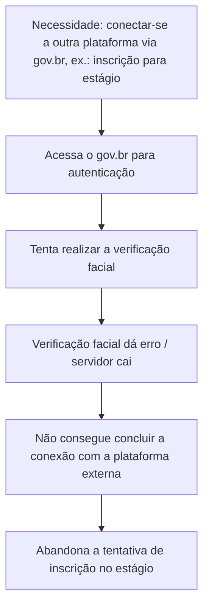
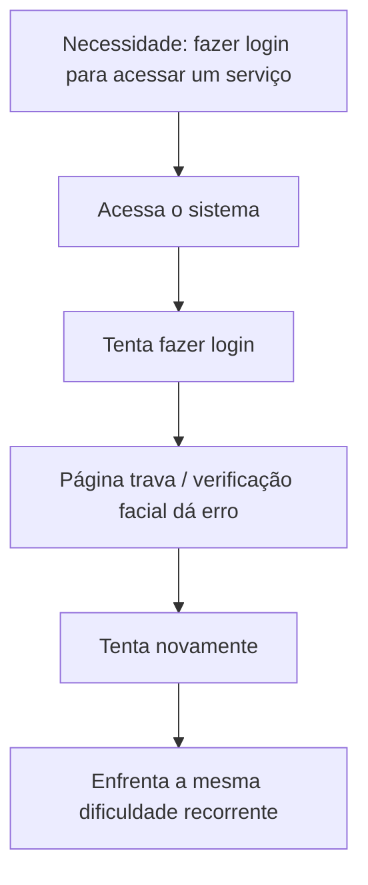
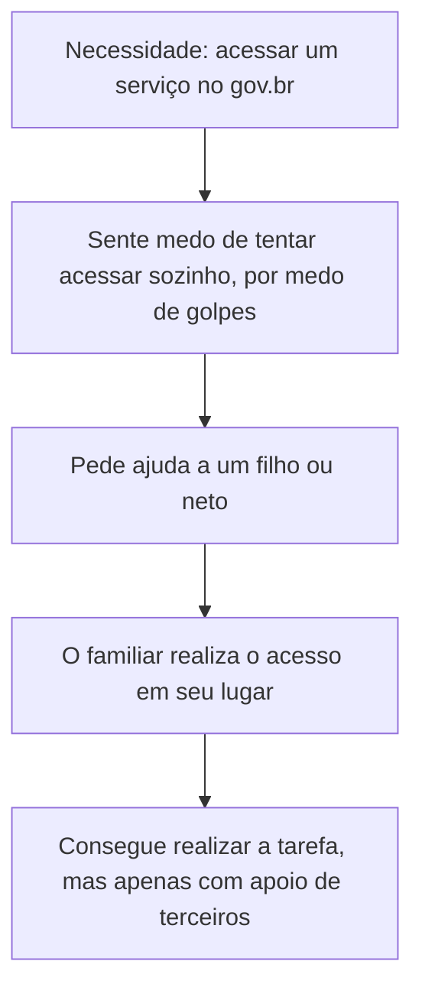

# Projeto_UX_UI_1-Atividade.md
Projeto de UX UI ( Design Thinking )

# Atividade de UX/UI — Site gov.br

## Sumário

- [Etapa 1 — Pesquisa](#etapa-1--pesquisa)
- [Etapa 2 — Definição do problema](#etapa-2--definição-do-problema)
- [Etapa 3 — Personas](#etapa-3--personas)
- [Etapa 4 — Jornadas do usuário](#etapa-4--jornadas-do-usuário)

---

## Etapa 1 — Pesquisa

### Usuários identificados e suas tarefas

| Usuário | Perfil | Tarefa no site | Dificuldade relatada |
|---|---|---|---|
| Pedro, 18 anos | Universitário, solteiro | Usar o gov.br como autenticação para se conectar a outras plataformas (ex.: inscrição em estágio) | Erros na verificação facial e queda do servidor no momento da tentativa, impedindo a conclusão da inscrição |
| Marinete, 46 anos | Autônoma, casada | Fazer login no sistema para acessar serviços | Login difícil, páginas que travam constantemente e verificação facial que sempre dá erro |
| José de Assis, 78 anos | Aposentado, divorciado | Acessar serviços do gov.br | Dificuldade de acesso e medo de cair em golpes; por isso pede ajuda de filhos ou netos |

### O que causa frustração

- Falhas técnicas recorrentes (login, verificação facial, instabilidade do servidor).
- No caso do usuário idoso, insegurança e desconfiança em relação à própria capacidade de usar o site sem cair em fraudes.

### Como resolvem atualmente

- [x] **José** — não usa o site sozinho; delega a tarefa a familiares.
- [x] **Marinete** — insiste no processo de login, mesmo com travamentos e erros na verificação facial.
- [x] **Pedro** — depende do site funcionar no momento certo para concluir processos externos (como a inscrição em estágio); quando o servidor cai, a tarefa não é concluída.

---

## Etapa 2 — Definição do problema

> **Problema:** Usuários de diferentes faixas etárias enfrentam barreiras distintas ao usar o gov.br: usuários mais jovens e adultos sofrem com falhas técnicas recorrentes (erros na verificação facial, travamentos e instabilidade do servidor) que impedem a conclusão de tarefas importantes, enquanto usuários idosos evitam o uso direto do sistema por medo de golpes, dependendo de terceiros para realizar até tarefas simples.

Esse problema é sustentado pelas evidências da pesquisa: os três perfis relatam pontos de falha diferentes, mas todos resultam na mesma consequência — **a tarefa não é concluída pelo próprio usuário sem obstáculos ou ajuda externa.**

---

## Etapa 3 — Personas

<table>
<tr>
<th>Persona 1 — Pedro</th>
<th>Persona 2 — Marinete</th>
<th>Persona 3 — José de Assis</th>
</tr>
<tr>
<td valign="top">

**Idade:** 18 anos
**Estado civil:** solteiro
**Perfil:** universitário

**Objetivo:**
Usar o gov.br como meio de autenticação para acessar outras plataformas necessárias à vida acadêmica/profissional

**Necessidade:**
Que a verificação facial funcione corretamente e que o servidor esteja disponível no momento em que precisa

**Dificuldade:**
Verificação facial com erro e queda do servidor justamente ao tentar se inscrever para um estágio

**Comportamento:**
Só acessa o gov.br pontualmente, como intermediário para outro serviço — não é um uso recorrente

</td>
<td valign="top">

**Idade:** 46 anos
**Estado civil:** casada
**Perfil:** autônoma

**Objetivo:**
Fazer login no sistema para acessar os serviços de que precisa

**Necessidade:**
Um processo de login estável, sem travamentos e sem falhas na verificação facial

**Dificuldade:**
Páginas que travam constantemente e verificação facial que sempre dá erro

**Comportamento:**
Insiste tentando fazer login repetidamente, mesmo enfrentando a mesma falha

</td>
<td valign="top">

**Idade:** 78 anos
**Estado civil:** divorciado
**Perfil:** aposentado

**Objetivo:**
Conseguir acessar os serviços do gov.br

**Necessidade:**
Sentir segurança para usar o site sem medo de ser vítima de golpe

**Dificuldade:**
Dificuldade de acesso somada ao medo de cair em fraudes

**Comportamento:**
Não tenta usar o site sozinho; pede ajuda a filhos ou netos para realizar o acesso

</td>
</tr>
</table>

---

## Etapa 4 — Jornadas do usuário

### Jornada de Pedro

### Jornada de Marinete

### Jornada de José de Assis

### Principais pontos de dificuldade identificados nas três jornadas

1. Falha na verificação facial (Pedro e Marinete).
2. Instabilidade/queda do servidor no momento crítico da tarefa (Pedro).
3. Travamento recorrente das páginas (Marinete).
4. Barreira de confiança e medo de golpes, que impede o uso autônomo (José).
